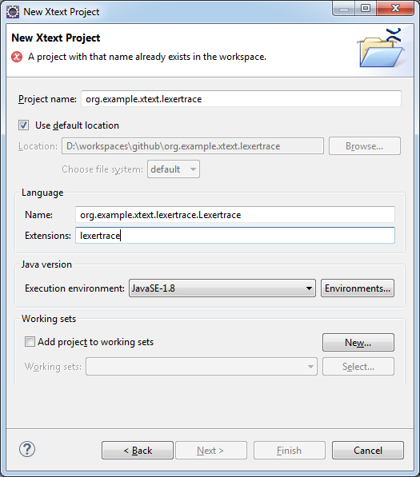
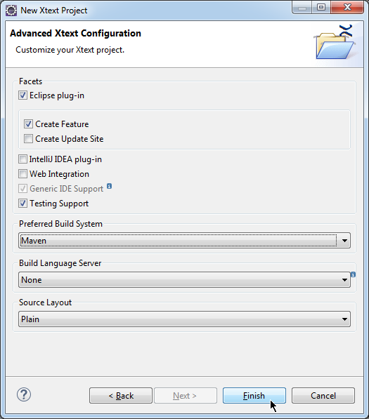
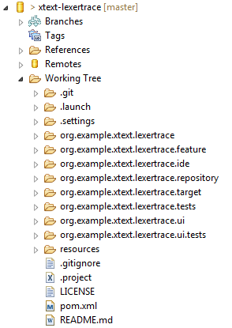

# xtext-lexertrace

This demo shows how to trace the lexer tokens that are fed to the parser. Whenever you are
trying to understand why the parser does not work as expected it is helpful to understand
what is happening in the background.

## Building the example project

I use Eclipse as my IDE. I added some launch configurations to the project to simplify using
this example project. After you have cloned the repository using **EGit** you need to import all
projects (including the root) into your workspace.

After that you can use the preconfigured launch configurations:

* `lexertrace - Generate Language Infrastructure` 
  to generate the Xtext artifacts making up the language
* `lexertrace - Launch Runtime Eclipse`
  to launch the Eclipse Runtime to test the language
* `lexertrace - mvn clean`
  to clean up the workspace
* `lexertrace - mvn clean package`
  to build the p2 repository
* `lexertrace - mvn tycho set version`
  to set a new version for the Maven Tycho build

## Setting up your own project

I used Eclipse Oxygen 1.a with Xtext 2.13 to create the project:

 

This will create a basic Xtext project with a simple [Hello World grammar]
(https://www.eclipse.org/Xtext/documentation/102_domainmodelwalkthrough.html#write-the-grammar "Hello World grammar").   

I prefer to create the following GIT repository layout:

This is unfortunately not possible to create with **EGit**. Therefore I use the following steps:

* Create or clone a new GIT repository
* Create the Xtext project using the wizards
* Delete the projects from the workspace (do **not** delete project contents on disk)
* Move the content of the maven parent project into the Working Tree directory
* Delete the (empty) parent project folder from the workspace
* Use EGit Import Projects to put the projects back into the workspace

Hopefully there will be someone on the **EGit** team to make this possible in the future. If you
currently share the parent project into a GIT repository you get a subfolder containing the
maven modules. **Never share the module projects! They are shared automatically with the parent.** 
 